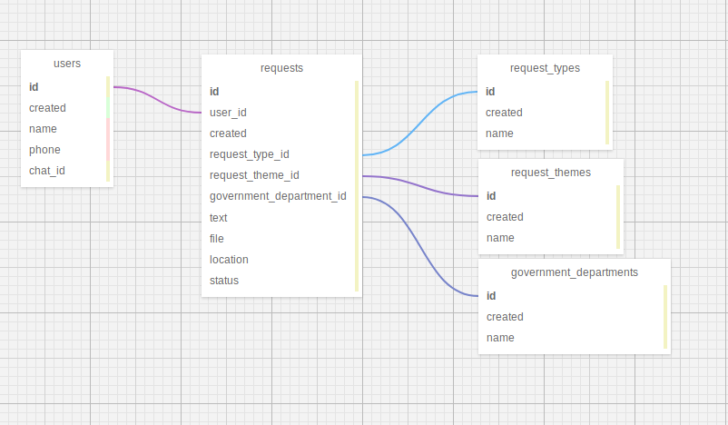

# Asia-Soft-Bot-/

## База данных

*Примечание*

#### пользователи users
id - primary_key__
created - datetime обязательно, по умолчанию текущая дата и время \
name - varchar обязательно 256 символов \
phone - varchar обязательно 256 символов \
chat_id - varchar обязательно 256 символов \

#### обращение requests
id - primary_key \
user_id - int обязательно \
created - datetime обязательно, по умолчанию текущая дата и время \
request_type_id - int необязательно \
request_theme_id - int необязательно \
government_department_id - int необязательно \
text - varchar  обязательно 800 символов максимум \
file - varchar необязательно 256 символов \
location - varchar необязательно 256 символов \
status - int обязательно 1 символ \

#### виды обращения request_types
id - primary_key \ 
created - datetime обязательно, по умолчанию текущая дата и время \
name - varchar обязательно 256 символов \

#### темы обращения request_themes
id - primary_key \
created - datetime обязательно, по умолчанию текущая дата и время \
name - varchar обязательно 256 символов \

#### гос учереждения для рассмотрения government_departments
id - primary_key \
created - datetime обязательно, по умолчанию текущая дата и время \
name - varchar обязательно 256 символов
